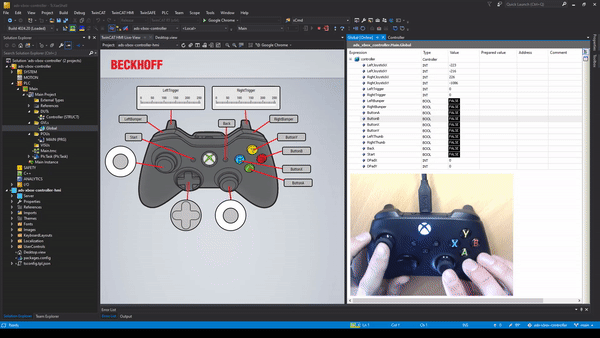

# Simple example of using an Xbox controller with TwinCAT

## Disclaimer
This is a personal guide not a peer reviewed journal or a sponsored publication. We make
no representations as to accuracy, completeness, correctness, suitability, or validity of any
information and will not be liable for any errors, omissions, or delays in this information or any
losses injuries, or damages arising from its display or use. All information is provided on an as
is basis. It is the reader’s responsibility to verify their own facts.

The views and opinions expressed in this guide are those of the authors and do not
necessarily reflect the official policy or position of any other agency, organization, employer or
company. Assumptions made in the analysis are not reflective of the position of any entity
other than the author(s) and, since we are critically thinking human beings, these views are
always subject to change, revision, and rethinking at any time. Please do not hold us to them
in perpetuity.

## Overview 
This is a proof of concept that you can use interface an xbox controller to TwinCAT via ADS.  In this example we use a Python script in order to provide the controller wrapper.  

## Getting Started
First start the PLC project running.  Next run the python script on the same IPC as the TwinCAT runtime.  Finally open Desktop.view and start live view by pressing the small [L] on the right hand side.    

## Screenshot

## Versions
* TcXaeShell 3.1.4024.20
* TE2000 1.12.750.1

## Need more help?
Please visit http://beckhoff.com.au/ for further guides

## Acknowledgments

* [Pyads](https://pypi.org/project/pyads/) - ADS library
* [TensorKart](https://github.com/kevinhughes27/TensorKart) - Code snippet for the controller
